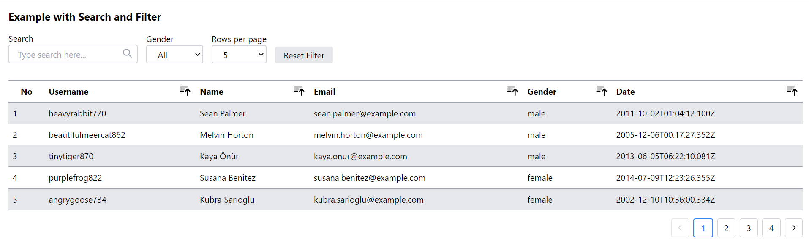
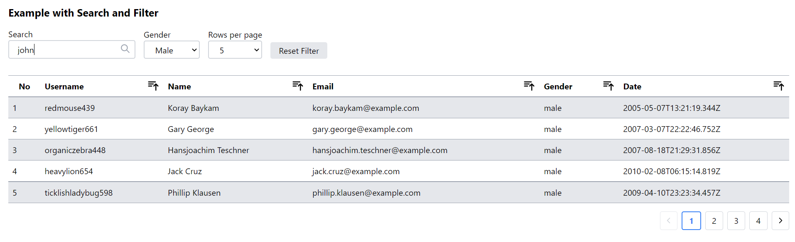
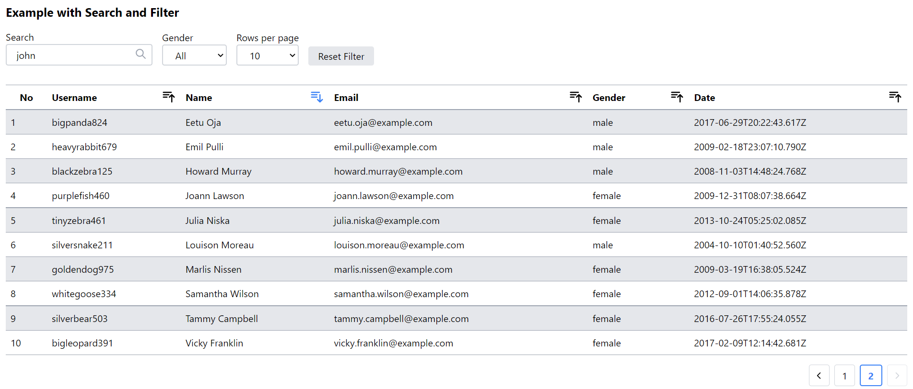

<h1 align="center">Table Search and Filter</h1>

## Description

This is a project to fetch random people data and present it in data table. This data can be searched by keyword or filter by gender. The input keyword and selected gender can be clear by clicking the reset button. The table can be sorted in ascending or descending order, displays data in 5, 10 or 20 rows and also has pagination.

### First load

- On the first load, the keyword field would be empty, the gender is all and the data display by 5 rows

  

### Filter filled

- This is the datatable when the filter is filled

  

### First Load

- And this is the table when sort by name ascending order, display 10 rows in the page 2

  

## About the project.

This project was created with create-react-app, context for state management and tailwind for styling. This project also has a responsive display when accessed from various screen sizes / devices.

## Project setup

After cloning repository, follow instruction below.

In the project directory, you can run:

### `npm install`

Install all depedencies of this project. And then:

### `npm start`

Runs the app in the development mode. 
Open [http://localhost:3000](http://localhost:3000) to view it in the browser.

### `npm build`

Builds the app for production to the `build` folder. 
It correctly bundles React in production mode and optimizes the build for the best performance.

## Vercel

Or you can see the production mode that I've deployed on [vercel](https://ilham-person-table.vercel.app/)
